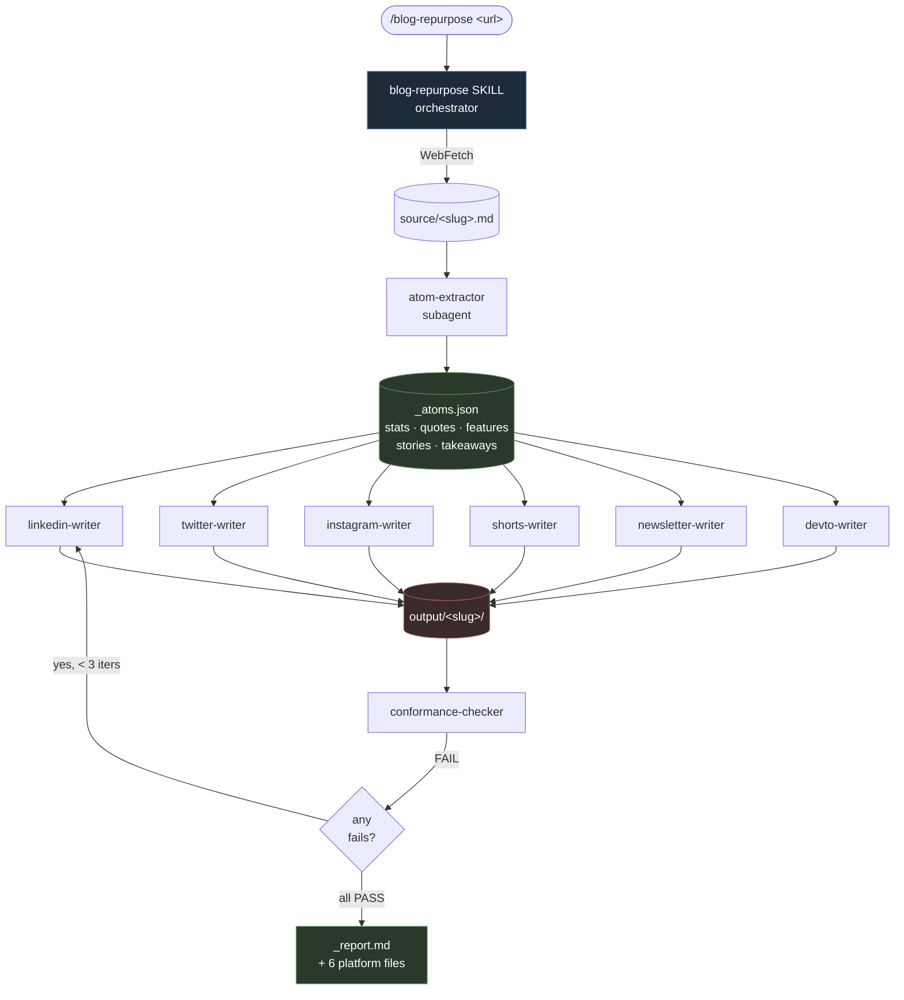

# blog-repurpose

**One blog URL in. Six platform-native pieces out.**

A Claude Code pipeline that turns a single blog post into LinkedIn posts, an X/Twitter thread, an Instagram carousel, a Shorts/Reels script, a newsletter section, and a Dev.to article — each written in the voice and format the platform actually rewards. Runs locally. Fans out to specialized subagents in parallel. Validates every output against an executable conformance spec. Self-retries what fails.

Built for the [Abugo CMO hiring challenge #04](https://github.com/abugodev/cmo-hiring).

---

## How it works



1. **Fetch.** Skill pulls the URL, saves a clean `source/<slug>.md`.
2. **Decompose.** `atom-extractor` subagent turns the post into reusable atoms — stats, quotes, features, stories, takeaways, CTA options — as `_atoms.json`. This is the contract between the blog and every platform.
3. **Fan out.** Six platform writer subagents run **in parallel**. Each one reads the atoms + shared brand voice + its own platform format rules, then writes one markdown file.
4. **Validate.** `conformance-checker` runs the per-platform YAML spec against each output. Character counts, hook lengths, heading structure, UTM tags, hashtag discipline — all mechanical. Reports pass/fail per rule.
5. **Ralph retry.** Failing platforms get re-invoked with the specific conformance failures fed back in. Up to 3 iterations. Then stop.

No hand-polished content — the whole point is a repeatable system where fixing an output means editing `platforms/<x>.md` or `conformance/<x>.yaml`, not the generated post.

## Quickstart

```sh
cd 04-blog-to-multiplatform
claude
```

Then in the Claude Code session:

```
/blog-repurpose https://www.shopsys.com/release-highlights-18-0-0/
```

## What you get

```
output/<slug>/
├── _source.md      ← fetched blog, verbatim
├── _atoms.json     ← decomposed content atoms
├── _report.md      ← conformance pass/fail per platform per rule
├── linkedin.md     ← 2-3 posts, distinct angles, UTM-tagged
├── twitter.md      ← 5-9 tweet thread, ≤280 chars each, one link
├── instagram.md    ← 5-slide carousel (Hook / Stat / Value / Proof / CTA) + caption
├── shorts.md       ← 30-45s script with beats, shot list, on-screen text
├── newsletter.md   ← subject + preview + 180-260 word body
└── devto.md        ← 500-900 word technical article with real code blocks
```

Live example: [`output/release-highlights-18-0-0/`](output/release-highlights-18-0-0/) — all six platforms, ALL PASS after one retry iteration.

## Why it's structured this way

- **Deterministic orchestrator, AI workers.** The skill owns the flow; subagents are specialists. You can read the pipeline in one file.
- **Atoms as a contract.** Platform writers never read the raw blog — they read `_atoms.json`. Keeps decomposition decoupled from platform voice.
- **Intent over prompts.** `brand/shopsys.md` + `platforms/<x>.md` are the source of truth. Rewriting the intent files changes every future run — no prompt surgery.
- **Conformance as executable spec.** `conformance/<x>.yaml` is mechanical. If a subagent drifts, the checker fails it, the orchestrator re-runs it. No "looks good enough" vibes.
- **Ralph loop, bounded.** Three retries, then report what's left. Avoids infinite regeneration loops.

## Repo layout

```
04-blog-to-multiplatform/
├── README.md
├── PLAN.md                        ← full design notes
├── .claude/
│   ├── skills/blog-repurpose/
│   │   └── SKILL.md               ← orchestrator, user-invoked
│   └── agents/
│       ├── atom-extractor.md
│       ├── linkedin-writer.md
│       ├── twitter-writer.md
│       ├── instagram-writer.md
│       ├── shorts-writer.md
│       ├── newsletter-writer.md
│       ├── devto-writer.md
│       └── conformance-checker.md
├── brand/
│   └── shopsys.md                 ← voice, audience, proof library, anti-patterns
├── platforms/                     ← intent: format rules per channel
│   ├── linkedin.md · twitter.md · instagram.md
│   └── shorts.md · newsletter.md · devto.md
├── conformance/                   ← executable specs (YAML)
│   └── *.yaml (one per platform)
├── source/                        ← fetched blog posts cached by slug
└── output/<slug>/                 ← generated content per run
```

## Scaling the same pattern

- **New platform?** Add `platforms/<x>.md` + `conformance/<x>.yaml` + `.claude/agents/<x>-writer.md`, wire into SKILL.md's fan-out. ~30 minutes.
- **New brand?** Swap `brand/shopsys.md` for `brand/<brand>.md` and adjust SKILL.md reference. Re-use every subagent.
- **Auto-trigger on new blog post?** Point a local launchd job at the blog's RSS feed; when a new entry lands, run `claude -p "/blog-repurpose <url>" --allowedTools "WebFetch,Read,Write,Task"` headlessly. Outputs land in `output/<slug>/` for human review.
- **Measure what wins?** UTMs are already baked in per channel. Pull analytics by `utm_campaign=<slug>` and feed the winners back into `platforms/<x>.md`. Next run writes to the proven pattern.

Built with [Claude Code](https://claude.com/claude-code).
